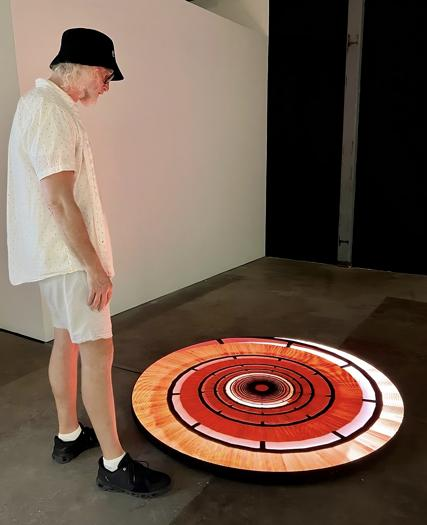

# Conférence : Jade Séguéla, registraire, Studio Antimoduar (Lozano-Hemmer)
Dans le cadre du cours d’œuvres et dispositifs multimédias en exposition, j’ai eu la chance d’assister à une conférence le 16 avril 2024 au Collège Montmorency à la Salle Claude Legault. La présentatrice était Jade Séguéla, la registraire au Studio Antimodular fondé par Rafael Lozan-Hemmer. La conférence est à propos de la gestion logistique impliquée dans la collection, la mise en exposition et la présentation de l'œuvre numérique d'un artiste.

Dans un premier temps, Jade Séguéla nous présente le Studio Antimodular. Elle parle de Rafael Lozano-Hemmer, les rôles des employés, les différents départements, les types d’interactivités utilisés dans les œuvres de Lozano-Hemmer. Aussi, elle parle de son rôle en tant que registraire. Son rôle au sein du studio est très important puisqu’elle s’occupe de la documentation, de l’inventaire des œuvres, de l'importation, de l'exportation, de l'installation des œuvres, etc.

Dans un deuxième temps, Jade Séguéla parle d’une étude de cas qui est à propos de la documentation d’une exposition avant un envoi à l’étranger. Elle donne un exemple de documentation avec leur œuvre « Last Breath ».
 
Finalement, Jade Séguéla parle d’une étude de cas en lien avec leur œuvre « Translation Stream » présentée à Abu Dhabi. Elle parle de ce qui devait être préparé à Montréal et envoyé à Abu Dhabi. Aussi, elle parle des enjeux en lien avec le lieu et la construction de l’œuvre.

En conclusion, j’ai bien aimé la conférence, parce que Jade Séguéla nous a démontré l’importance de la documentation d’une œuvre ou d'un dispositif numérique présentés hors du pays. La réalisation des œuvres serait difficile sans la production de ses documentations, même presque impossible. Aussi, j’apprécie beaucoup Rafael Lozan-Hemmer qui met l’importance sur la conservation des arts.

 Rafael Lozano-Hemmer, "Descending a Parametric Staircase", 2023, bitforms gallery, San Francisco, California, United States

 (source: https://www.lozano-hemmer.com/)

