# *Crescentia*
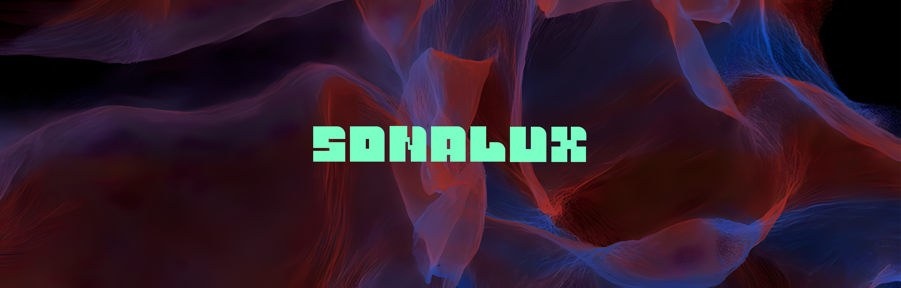
### Lieu de mise en exposition: Collège Montmorency - C-1710 et C-1712 - 475 Bd de l'Avenir, Laval, QC H7N 5H9
 Vue extérieur         |  Vue intérieur
:-------------------------:|:-------------------------:|
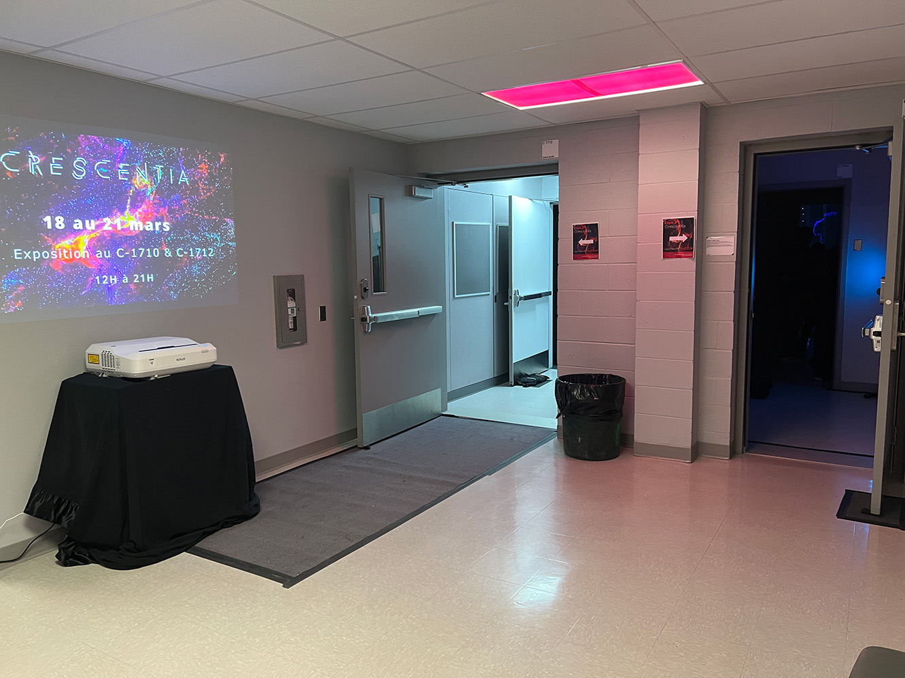 | 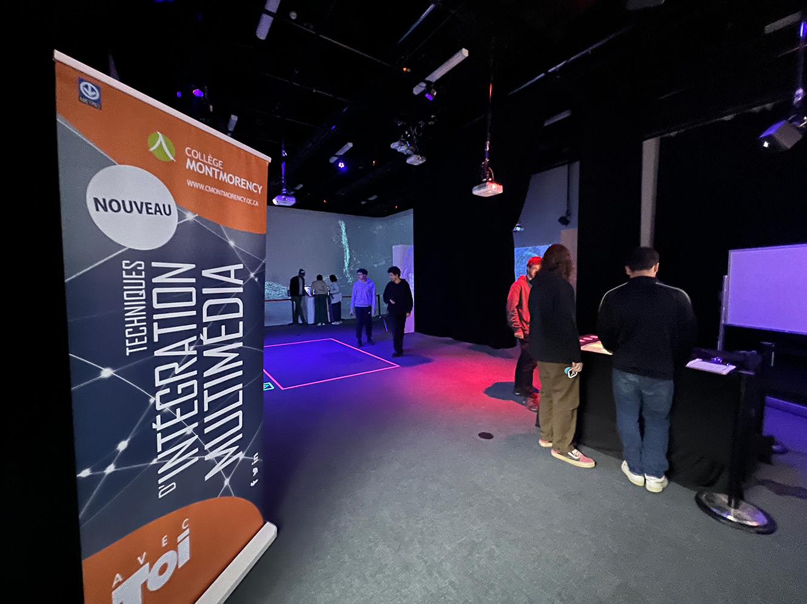

### Type d'exposition: temporaire - intérieure (18 au 21 mars 2024)
### Date de la visite: 18 mars 2024

## SONALUX
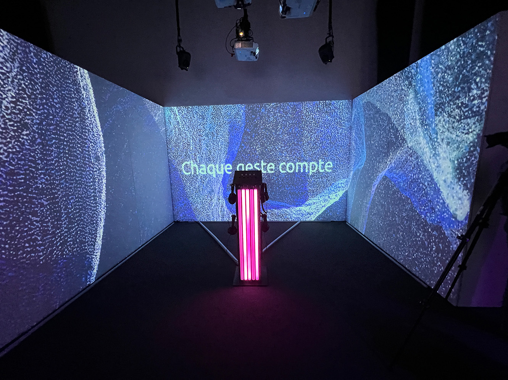
### Nom des artiste: Antoine Haddad, Camélie Laprise, Ghita Alaoui, Vincent Desjardins

### Année de réalisation: 2024

## Description du dispositif
> «Plongez dans une expérience où le temps s'efface pour laisser place à une exploratio créative sans limites. Notre œuvre vise à créer un moment d'évasion, une bulle hors d temps où vous pouvez vous abandonner à votre imagination et laisser éclore votre créativité. En suspendant la temporalité, nous vous invitons à vous libérer des contr et à vous laisser emporte par un flux d'inspiration infini. Dans un monde où checue est une note dans la symphonie de nos vies, il est essentiel de cultiver la curiosite, ce étincelle qui alimente la création de beauté et d'innovation. Être curieux, c'est ouvrir la porte à de nouvelles perspectives, à des découvertes inattendues et à des moments d'émerveillement. En encourageant la curiosité, notre œuvre aspire à inspirer chacun à explorer le monde qui l'entoure avec un regard neuf et à embrasser les possibilités infi qui se présentent à nous lorsque nous nous aventurons dans l'inconnu. - TouchDesigner, prjection triple (3840x720p), Micontrôleur»¹
>
> -- <cite>¹Collège Montmorency, «SONALUX», Antoine Haddad, Camélie Laprise, Ghita Alaoui, Vincent Desjardins , 2024</cite>

Cartel        | 
:-------------------------:|
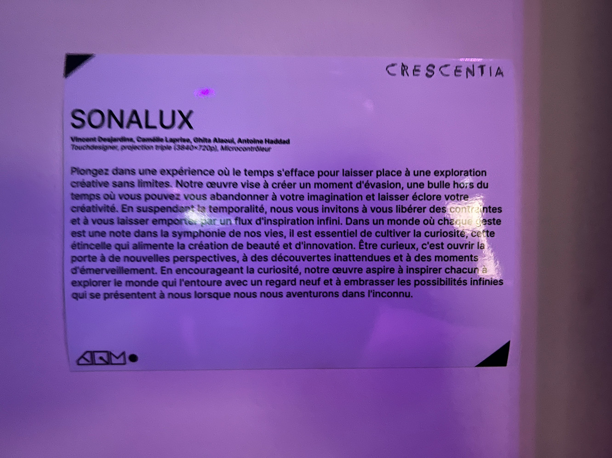

Vue diverses 

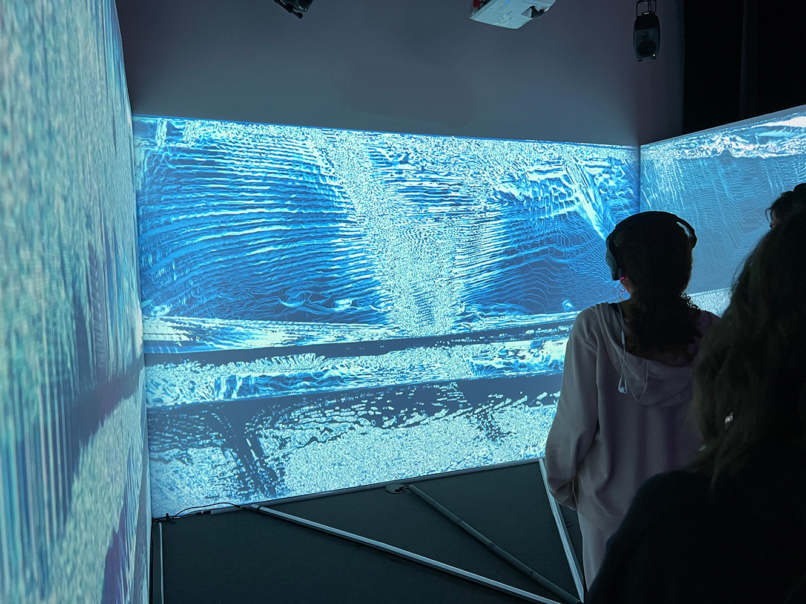 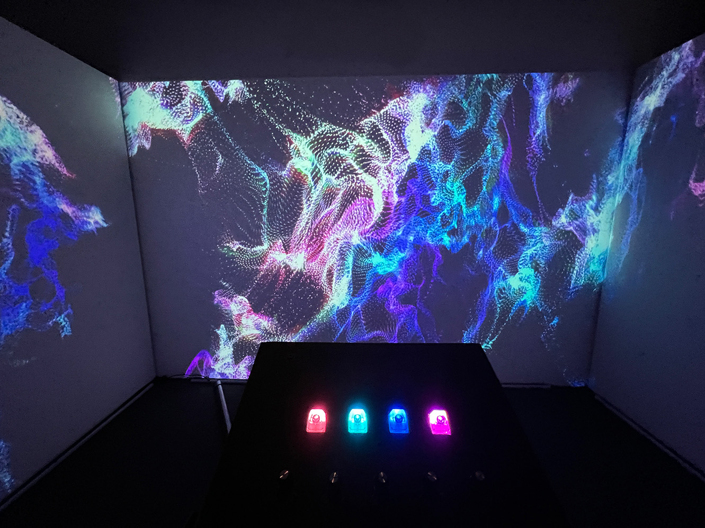 

## Type d'installation
Installation intéractive et immersive

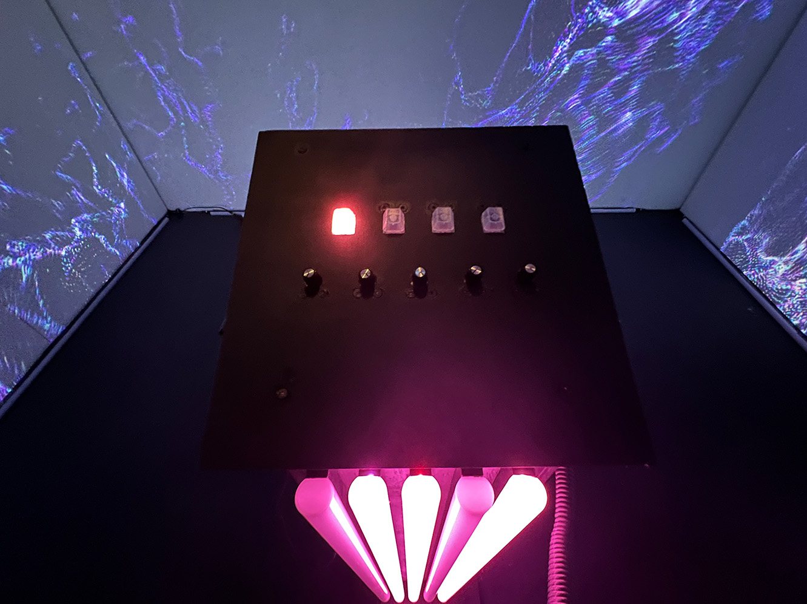

Exemple vidéo:

## Fonction du dispositif multimédia
L'intéracteur porte un casque d'écouteur et control une console qui controle l'environnement sonore et visuel. L'intéracteur peut contrôle les sons qui entend et son volume.

Console| 
:-------------------------:|

## Mise en espace
Vue ensemble de la pièce

Schéma de plantation

(source: https://tim-montmorency.com/2024/projets/Sonalux/docs/web/preproduction.html )

L'expérience SONALUX se trouve dans la partie avec les trois murs dont deux sont mobile, et un grand rideau noir.

## Composantes et techniques
### Les artistes ont utilisée:
>M5Stack
>* 3 Atom Lite
>* 3 Atom POE
>* 5 Angle Unit
>* 4 Key Unit
>* 2 ToF Unit
>* 2 PBHub
>* 1 GroveHub
>* 1 PaHub
>
>Contenu multmidédia
>* 3 paysages visuels génératifs (TouchDesigner)
>* 2 paysages sonores (VCV Rack)
>  
>Autre
>* Microcontrôleur
>* Podium
>* 4 crochets
>  
> (source : https://tim-montmorency.com/2024/projets/Sonalux/docs/web/preproduction.html)

M5Stack        | Ensemble des composantes
:-------------------------:|:-------------------------:|
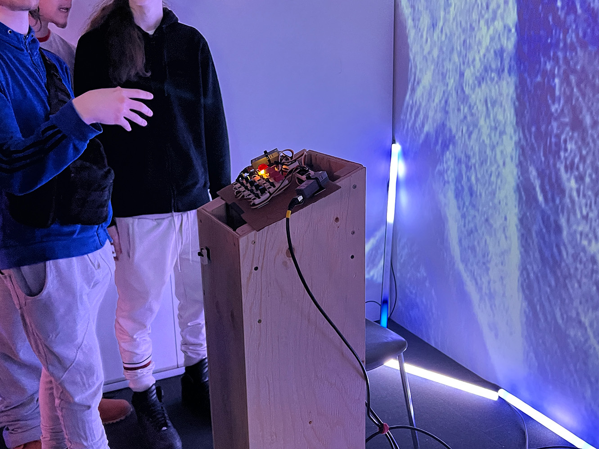 | 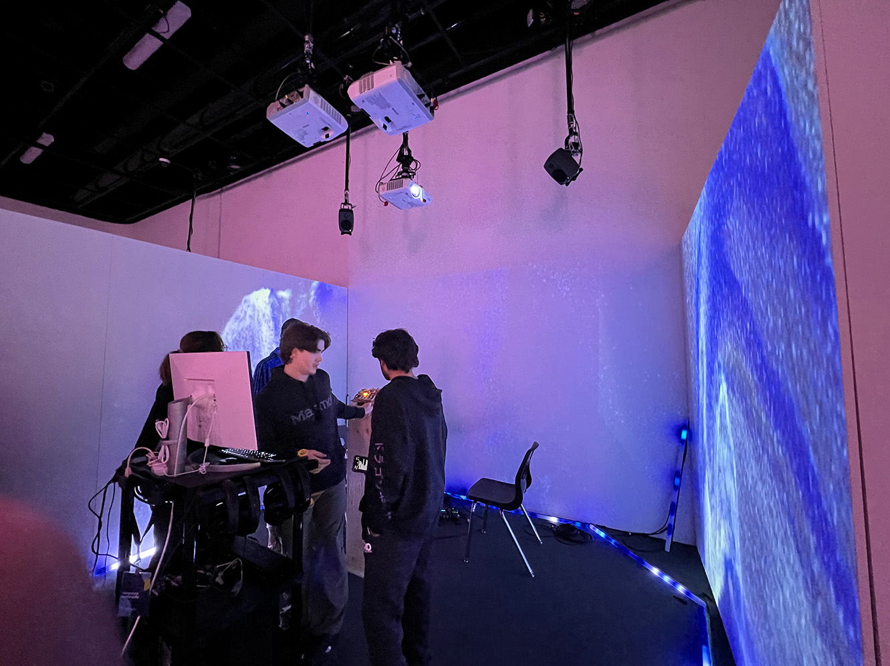

## Éléments nécessaires à la mise en exposition

> Audio
>* 2 haut-parleurs actifs de 4"
>* 4 fils XLR 3 conducteurs de 15' (M->F)
>* Interface audio USB disposant 8 sorties et au moins 1 entrée
>* 4 casques d'écouteurs
>* Carte de son
>
>Vidéo
>* 3 projecteurs vidéo lentille grand angle 0.5
>
>Électricité
>* cordons IEC (pour l'alimentation des haut-parleurs)
>* 2 extentions 3 fiches et 3 conducteurs
>* 2 multiprises
>
>Réseau
>* 4 fils cat6a de 15"
>* Switch POE 5 ports
>
>Ordinateur
>* 1 ordinateur portable
>* 1 ordinateur sur chariot
>  
>Autre
> * 2 murs mobiles
>   
> (source : https://tim-montmorency.com/2024/projets/Sonalux/docs/web/preproduction.html)

## Expérience vécue
Après que le visiteur a passé par les grands rideaux noir, il est acceuili par un podium avec des casques d'écouteur acrochés sur le coté et une console de controle desssus. La console a 4 boutons lumineux et 4 boutons de volume, et chacun controle un environnement sonore. L'environnement visuel projecté sur les 3 murs dépends du paramètre choisi par le visiteur. Le visiteur est immersé grâce au fait qu'il est enfermé entre les murs et le rideau

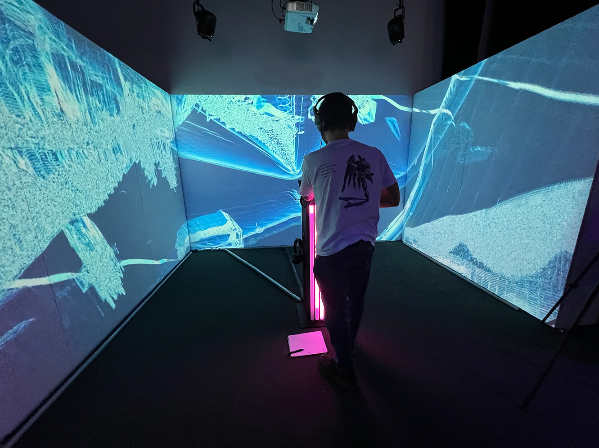

## Ce qui vous a plu, vous a donné des idées
Ce qui m'a plu est le fait le dispositif essaye de jouer avec la hyperstimulation de l'utilisateur avec le son et les images projectées. J'ai une idée similaire dont un musicien a le contrôle sur la console et c'est lui qui va créer l'audiovisuel devant une audience. Une autre idée similaire est de créer une expérience dont l'intéracteur peut entendre et voir la nature en temps réel. L'environnement peut être entendre et vue en 360 degré. 

##  Aspect que vous ne souhaiteriez pas retenir pour vos propres créations ou que vous feriez autrement
Un aspect que je ferai autrement est d'avoir une interface sur la projection ou sur le podium pour avoir une vue sur le contrôle des sons. Je penses avoir une interface va faire l'utilisateur jouer plus avec l'environnement de son puisqu'il voir ce qu'il fait en temps réel.
## Références
