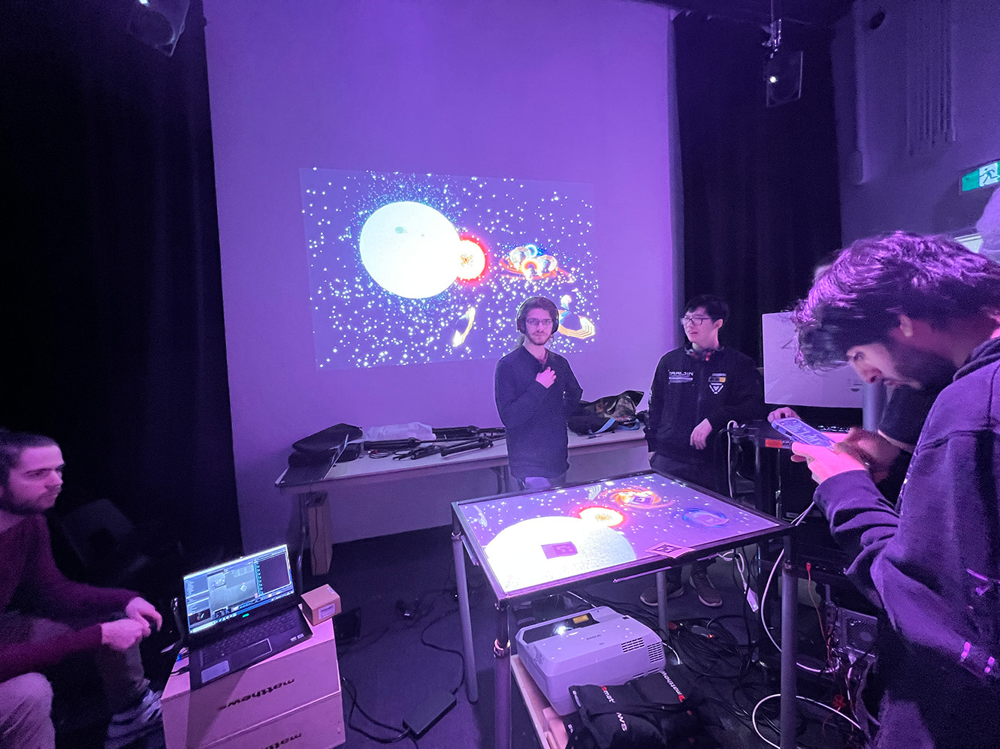
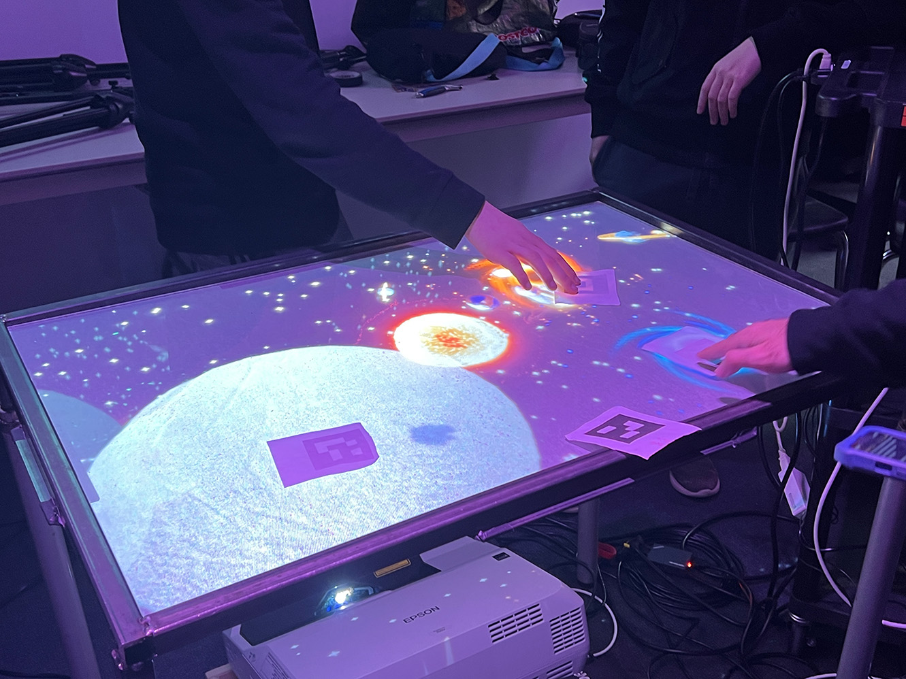
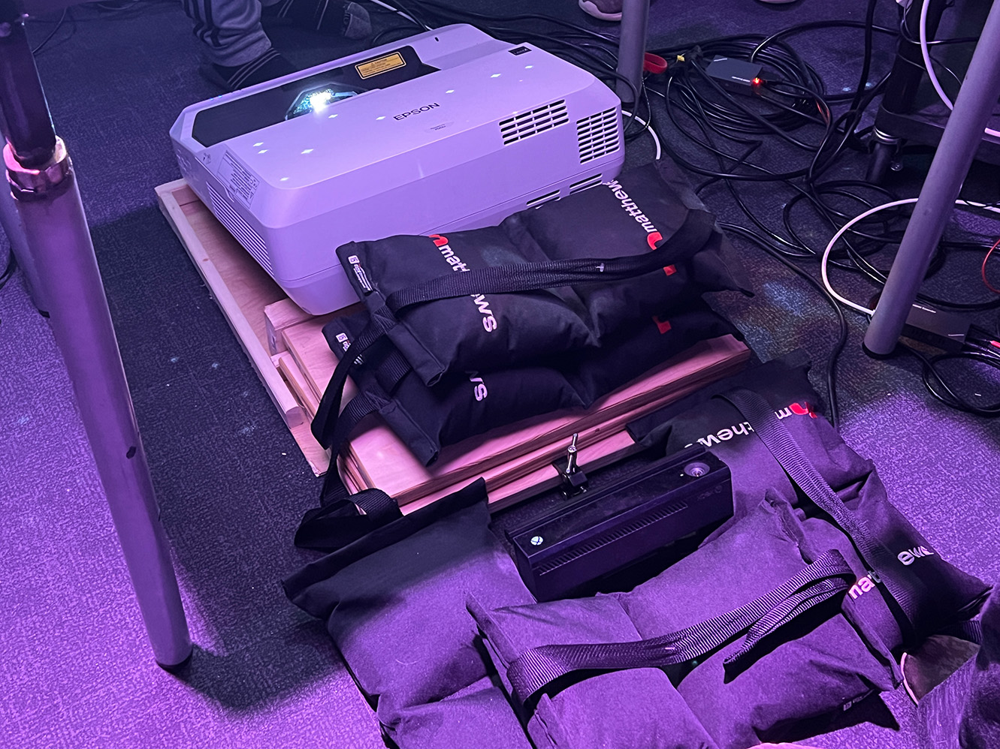
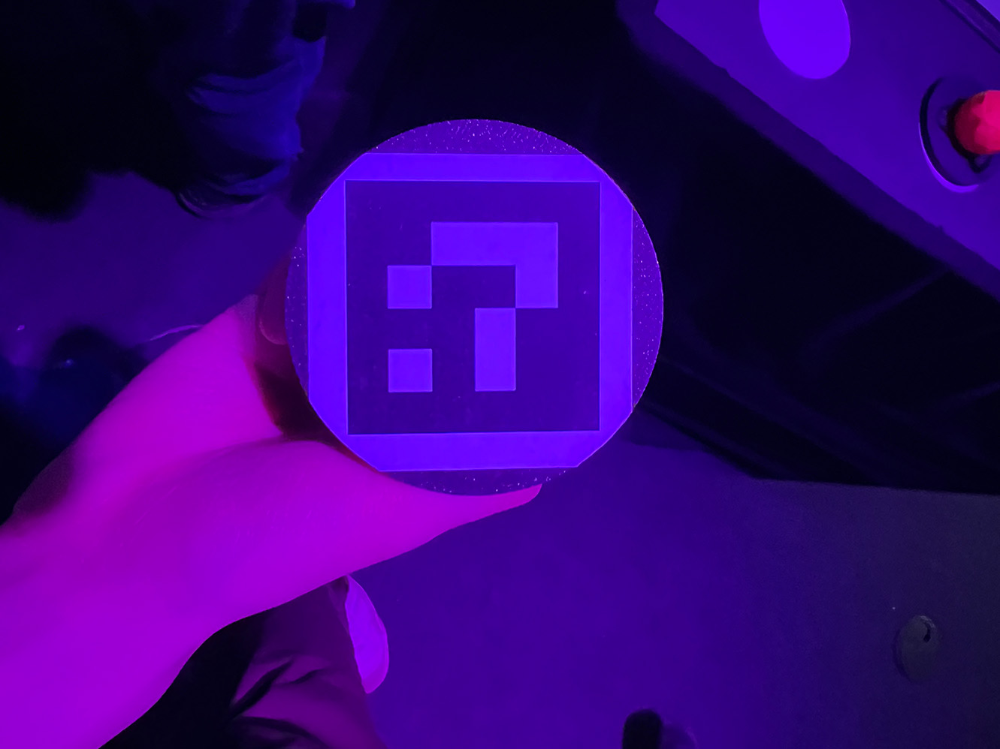

# Crescentia: Projets des finissants en TIM
# 1.Kigo
## Créateurs
* Vincent Desjardins
* Camélie Laprise
* Ghita Alaoui
* Antoine Haddad

## Lien du projet avec Crescentia
Le lien de ce projet avec la thème Crescentia est une évolution d'un monde ou du temps dans un voyage astral

## L'installation en cours
L'installation utilise trois murs blanc (deux mobiles), un grand rideau noir, deux projecteurs, trois projecteurs, quatre casques d'écouteur, et un podium avec des boutons de controls installés pour contrôler le paysage sonore et visuel projecté. 

 Vue ensemble       |  Vue du haut du podium | Vue de côté du podium
:-------------------------:|:-------------------------:| :-------------------------:|
 |  |  

## Schéma de l'installation

(Source: https://github.com/Sonalux2024/Sonalux/tree/main/docs/preproduction](https://tim-montmorency.com/2024/projets/Sonalux/docs/web/preproduction.html )

## Ressenti en expérimentant l'installation
J'ai ressenti que j'étais transporté dans un autre grâce aux audios utilisés et le fait que je suis enfermé entre des murs. Aussi le fait que je pouvais contrôler l'audio a beacoup ajouter à l'expérience. Par contre, le visuel projecté n'était pas très cohérent avec l'audio.

## Trois cours incontournables du programme
Trois cours incontournables du programme pour ce projet seraient le cours d'installation multimédia, le cours d'objects intéractifs et le cours de traitement visuel. Ils sont besoin de ses cours pour utiliser les microcontroleurs, pour les effets vidéos et sonores et pour les projectés.

## Technique ou composante technologique
TouchDesigner est un logiciel pour créer des expériences intéractives, des installations multimédias et générer en temps réel de l'art visuel. L'interface du logicel est facile à utiliser et peut facilement prendre les données des composantes électroniques.

## Préférence et justification
La raison que SONALUX est mon projet préféré est que l'expérience était simple, mais il était très bien fait. Aussi, c'était le seul projet dont le son est un aspect importance sur l'expérience audiovisuel.

# 2.Canevas cosmique
## Créateurs:
* Jacob Alarie-Brousseau 
* Jérémy Cholette 
* Étienne Charron 
* Quoc Huy Do 
* Mikaël Tourangeau

## Lien du projet avec Crescentia
Le lien de ce projet avec la thème Crescentia est l'intéraction des objets et de le système solaire qui s'évoluent avec le temps et le nombre d'intéraction entre eux.

## L'installation en cours
L'installation utilise une table, deux projecteurs, deux haut-parleurs, des statuettes et une Kinect,. Un projecteur sur le mur et un autre en dessous de la table. La Kinect est en-dessous de la table. Les statuettes ont des marqueurs en dessous d'elles qui permet de les identifiers par la Kinect.

 Vue ensemble       |  Vue de la table | Composantes en dessous de table | Marqeurs en dessous des statuettes
:-------------------------:|:-------------------------:| :-------------------------:|  :-------------------------:| 
 |  |  |  

## Schéma de l'installation

(Source: https://tim-montmorency.com/2024/projets/Canevas-Cosmique/docs/web/preproduction.html )

## Ressenti en expérimentant l'installation
J'ai ressenti que l'installation était vraiment amusant à expérimenter avec les différentes intéractions et créer plusieurs combinaisons. Le style du "3D low poly" des statuettes et des planètes étaient très bien fait et qui donnaient du charme.

## Trois cours incontournables du programme
Trois cours incontournables du programme pour ce projet seraient le cours d'installation multimédia, le cours de modélisation 3D et le cours d'intéractivié ludique. Ils sont besoin de ses cours pour utiliser créer les modèles 3D, des effets, l'intéractivité de chaque objet et de les projectés.

## Technique ou composante technologique
Le projet a utilisé du langage de programmation Python pour transmettre les données des marqeurs à TouchDesigner et à Unity. Je penses qu'ils sont utilisés la technique de communication inter-processus pour transmettre les donnés des marqeurs. C'est un processus qui peut être sur le même ou de différents systèmes de communication pour échanger les donners entre eux.

## Préférence et justification
La raison que Canevas comisque est mon deuxième projet préféré est que l'expérience était très intéractive et amusant. J'ai beaucoup aimé d'interagire avec les statuettes par contre j'ai remarqué que moi et les autres gens regroupaient tous les statuettes ensemble après 1 minute d'intéraction avec l'installation. Je penses qu'il manquait de complexité dans les intéractions. 

