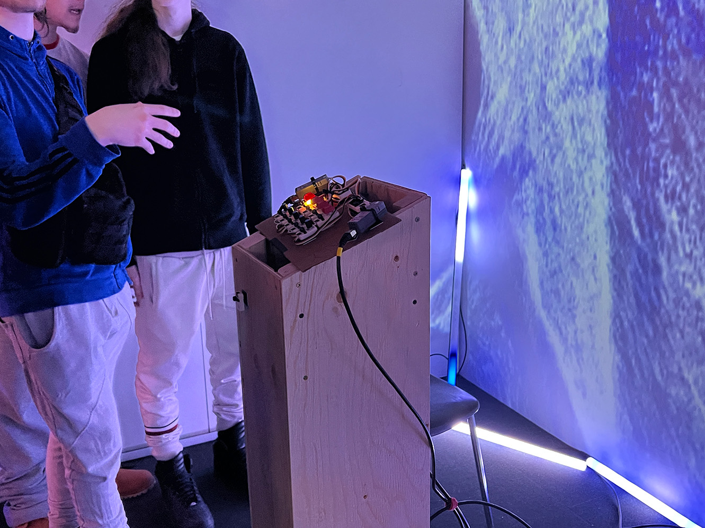

# Crescentia: Projets des finissants en TIM
# 1.SONALUX
## Créateurs
* Vincent Desjardins
* Camélie Laprise
* Ghita Alaoui
* Antoine Haddad

## Lien du projet avec Crescentia
Le lien de ce projet avec la thème Crescentia est une évolution d'un monde ou du temps dans un voyage astral

## L'installation en cours
L'installation utilise trois murs blanc (deux mobiles), un grand rideau noir, deux projecteurs, trois projecteurs, quatre casques d'écouteur, et un podium avec des boutons de controls installés pour contrôler le paysage sonore et visuel projecté. 

 Vue ensemble       |  Vue du haut du podium | Vue de côté du podium
:-------------------------:|:-------------------------:| :-------------------------:|
 |  |  

## Schéma de l'installation

(Source: https://github.com/Sonalux2024/Sonalux/tree/main/docs/preproduction](https://tim-montmorency.com/2024/projets/Sonalux/docs/web/preproduction.html )

## Ressenti en expérimentant l'installation
J'ai ressenti que j'étais transporté dans un autre grâce aux audios utilisés et le fait que je suis enfermé entre des murs. Aussi le fait que je pouvais contrôler l'audio a beacoup ajouter à l'expérience. Par contre, le visuel projecté n'était pas très cohérent avec l'audio.

## Trois cours incontournables du programme
Trois cours incontournables du programme pour ce projet seraient le cours d'installation multimédia, le cours d'objects intéractifs et le cours de traitement visuel. Ils sont besoin de ses cours pour utiliser les microcontroleurs, pour les effets vidéos et sonores et pour les projectés.

## Technique ou composante technologique
TouchDesigner est un logiciel pour créer des expériences intéractives, des installations multimédias et générer en temps réel de l'art visuel. L'interface du logicel est facile à utiliser et peut facilement prendre les données des composantes électroniques.

## Préférence et justification
La raison que SONALUX est mon projet préféré est que l'expérience était simple, mais il était très bien fait. Aussi, c'était le seul projet dont le son est un aspect importance sur l'expérience audiovisuel.

# 2.Canevas cosmique
## Créateurs
* Jacob Alarie-Brousseau 
* Jérémy Cholette 
* Étienne Charron 
* Quoc Huy Do 
* Mikaël Tourangeau

## Lien du projet avec Crescentia
Le lien de ce projet avec la thème Crescentia est l'intéraction des objets et de le système solaire qui s'évoluent avec le temps et le nombre d'intéraction entre eux.

## L'installation en cours
L'installation utilise une table, deux projecteurs, deux haut-parleurs, des statuettes et une Kinect,. Un projecteur sur le mur et un autre en dessous de la table. La Kinect est en dessous de la table. Les statuettes ont des marqueurs en dessous d'elles qui permet de les identifiers par la Kinect.

 Vue ensemble       |  Vue de la table | Composantes en dessous de table | Marqeurs en dessous des statuettes
:-------------------------:|:-------------------------:| :-------------------------:|  :-------------------------:| 
 |  |  |  

## Schéma de l'installation

(Source: https://tim-montmorency.com/2024/projets/Canevas-Cosmique/docs/web/preproduction.html )

## Ressenti en expérimentant l'installation
J'ai ressenti que l'installation était vraiment amusant à expérimenter avec les différentes intéractions et créer plusieurs combinaisons. Le style du "3D low poly" des statuettes et des planètes étaient très bien fait et qui donnaient du charme.

## Trois cours incontournables du programme
Trois cours incontournables du programme pour ce projet seraient le cours d'installation multimédia, le cours de modélisation 3D et le cours d'intéractivié ludique. Ils sont besoin de ses cours pour utiliser créer les modèles 3D, des effets, l'intéractivité de chaque objet et de les projectés.

## Technique ou composante technologique
Le projet a utilisé du langage de programmation Python pour transmettre les données des marqeurs à TouchDesigner et à Unity. Je penses que les étudiants ont utilisés la technique de communication inter-processus pour transmettre les donnés des marqeurs. C'est un processus qui peut être sur le même ou de différents systèmes de communication pour échanger les donners entre eux.

## Préférence et justification
La raison que Canevas comisque est mon deuxième projet préféré est que l'expérience était très intéractive et amusant. J'ai beaucoup aimé d'interagire avec les statuettes par contre j'ai remarqué que moi et les autres gens regroupaient tous les statuettes ensemble après 1 minute d'intéraction avec l'installation. Je penses qu'il manquait de complexité dans les intéractions. 

# 3.Kigo
## Créateurs
* Nicolas St-Martin
* Antoine Dion
* Érick Ouellette
* william Rathier Mailly
* Gabriel Clerval
  
## Lien du projet avec Crescentia
Le lien de ce projet avec la thème Crescentia est l'évolution de la difficulté du jeu et du décor dans le jeu.

## L'installation en cours
L'installation utilise un projecteur, une Kinect, deux haut-parleurs, une zone délimité par des rubans adhésifs orange. La zone est la zone que la Kinect détecté le joueur.  

 Vue ensemble       |  Vue ensemble des composantes | Vue finale
:-------------------------:|:-------------------------:| :-------------------------:| 
 |  |  | 

## Schéma de l'installation

(Source: https://tim-montmorency.com/2024/projets/Kigo/docs/web/preproduction.html )

## Ressenti en expérimentant l'installation
J'ai ressenti que l'installation était vraiment amusant, c'était la seule installation que c'était un jeu. La Kinect détectait des fois un peu mal mes mouvements.

## Trois cours incontournables du programme
Trois cours incontournables du programme pour ce projet seraient le cours de réalité mixte, le cours de modélisation 3D et le cours d'animations 3D. Les étudiants ont besoin de ses cours pour utiliser créer les modèles 3D, les animations et les intégrers pour créer une expérience immersive.

## Technique ou composante technologique
Le projet a utilisé la Kinect pour détecté les mouvements des joueurs. Il peut avoir deux joueurs dans la zone. Avec la Kinect, les étudiants pouvaient choisir la zone de limite que le jouer peut bouger. La Kinect a un projecteur infrarouge, un détecteur de distance et détecter les couleurs.

## Préférence et justification
La raison que Kigo est mon troisième projet préféré est que l'expérience était amusant et j'aimais que c'était un jeu vidéo. Par contre, la Kinect détecté mal mes movements quelque fois, mais ce n'est pas la faute des étudiants.

# 4.Rhizomatique
## Créateurs
* Jolyanne Desjardins
* Maïka Désy
* Laurie Houde
* Félix Testa Radonovic
  
## Lien du projet avec Crescentia
Le lien de ce projet avec la thème Crescentia est le temps de la vie et les souvenirs qui se dévoilent. C'est l'évolution de la vie de la personne.

## L'installation en cours
L'installation utilise trois projecteurs, quatre haut-parleurs, une toile, deux Kinects placées en dessous de la toile. L'intéracteur met sa main sur la toile et le bouge à travers la toile pour découvrir les souvenirs. Plus que la main reste longtemps sur la toile plus que le souvenir va être projecté longtemps.

 Vue ensemble       |  Vue du plafond | Vue en dessous de la toile
:-------------------------:|:-------------------------:| :-------------------------:| 
 |  |  | 

## Schéma de l'installation

(Source: https://tim-montmorency.com/2024/projets/Rhizomatique/docs/web/preproduction.html )

## Ressenti en expérimentant l'installation
J'ai ressenti que l'installation était intéressant avec son utilisation de la toile. C'était très immersif comme expérience puisque l'installation utilisait le cyclo.

## Trois cours incontournables du programme
Trois cours incontournables du programme pour ce projet seraient le cours d'installation multimédia, le cours de traitement d'audiovisuel et le cours d'intéractivité ludique. Les étudiants ont besoin de ses cours pour monter et créer un expérience audiovisuel liéé à un dispositif.

## Technique ou composante technologique
Le projet a utilisé la Kinect pour détecté les mouvements de la main de l'utilisateur, et dépendant du moment et du mouvement, il y a un audiovisuel qui joue. Les étudiants ont problament utiliser le projecteur d'infrarouge et le détecteur de distance de la Kinect pour cette expérience.

## Préférence et justification
La raison que Rhizomatique est mon quatrième projet préféré est que l'expérience était très immersive, et la projection et l'intéractivité de la toile est bien fait. Mais malheureusement, je ne trouvais pas intéressant.

# 5.Effet papillion
## Créateurs
* Alexis Bolduc
* Raphaël Dumont
* Jasmine Lapierre
* William Morel
* Alexia Papanikolaou
* Viktor Zhuravlev
  
## Lien du projet avec Crescentia
Le lien de ce projet avec la thème Crescentia est la croissance de la vie selon de chaque conséquence.

## L'installation en cours
L'installation se trouve au petit studio et il utilise des projecteurs, des petits écrans, des lumières, des haut-parleurs et plusieurs autres composantes uniques à leur projet. L'intéracteur doit peser sur bouton sur "l'arbre" qui se trouve au milieu et ensuite suivre les instructions aidé par une lumière. 

 Vue ensemble       |  Vue du plafond | Vue sur des composantes
:-------------------------:|:-------------------------:| :-------------------------:| 
 |  |  | 

## Schéma de l'installation

(Source: https://tim-montmorency.com/2024/projets/Effet-Papillon/docs/web/preproduction.html )

## Ressenti en expérimentant l'installation
J'ai ressenti que l'installation était intéressant et complexe, mais c'était une expérience linéaire et incomplet malheureusement.

## Trois cours incontournables du programme
Trois cours incontournables du programme pour ce projet seraient le cours d'installation multimédia, le cours de traitement d'audiovisuel et le cours d'objets intéractives. Les étudiants ont besoin de ses cours pour monter et créer un expérience audiovisuel qui peut être intéragi avec plusieurs objets.

## Technique ou composante technologique
Le projet a utilisé des Arduinos en arrière de chaque écran poue la transmission de données. Arduino est un microcontrôleur et un logiciel qui sont de source ouverte. L'utilisation est très facile grâce aux ressources en ligne et ils sont très versatiles.

## Préférence et justification
La raison que Rhizomatique est mon dernier projet préféré est que l'expérience était très lineaire et inconplet. J'imagine que le projet était trop complexe pour les étudients et ils manquaient du temps.
