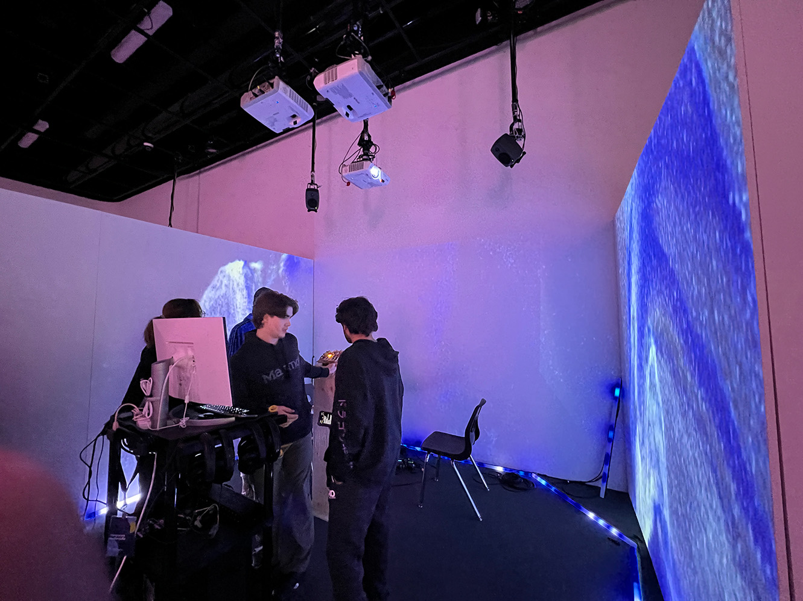

# Crescentia: Projets des finissants en TIM
# 1.Kigo
## Créateurs:
* Vincent Desjardins
* Camélie Laprise
* Ghita Alaoui
* Antoine Haddad

## Lien du projet avec Crescentia:
Le lien de ce projet avec la thème Crescentia est une évolution d'un monde ou du temps dans un voyage astral

## L'installation en cours:
L'installation utilise trois murs blanc (deux mobiles), un grand rideau noir, deux projecteurs, trois projecteurs, quatre casques d'écouteur, et un podium avec des boutons de controls installés pour contrôler le paysage sonore et visuel projecté. 

 Vue ensemble       |  Vue du haut du podium | Vue de côté du podium
:-------------------------:|:-------------------------:| :-------------------------:|
 |  |  

## Schéma de l'installation:

(Source: https://github.com/Sonalux2024/Sonalux/tree/main/docs/preproduction](https://tim-montmorency.com/2024/projets/Sonalux/docs/web/preproduction.html )

## Ressenti en expériement l'installation
J'ai ressenti que j'étais transporté dans un autre grâce aux audios utilisés et le fait que je suis enfermé entre des murs. Aussi le fait que je pouvais contrôler l'audio a beacoup ajouter à l'expérience. Par contre, le visuel projecté n'était pas très cohérent avec l'audio.

## Trois cours incontournables du programme:
Trois cours incontournables du programme pour ce projet seraient le cours d'installation multimédia, le cours d'objects intéractifs et le cours de traitement visuel. Ils sont besoin de ses cours pour utiliser les microcontroleurs, pour les effets vidéos et sonores et pour les projectés.

## Technique ou composante technologique:
TouchDesigner est un logiciel pour créer des expériences intéractives, des installations multimédias et générer en temps réel de l'art visuel. L'interface du logicel est facile à utiliser et peut facilement prendre les données des composantes électroniques.

## Préférence et justification
La raison que SONALUX est mon projet préféré est que l'expérience était simple, mais il était très bien fait. Aussi, c'était le seul projet dont le son qui mettait beaucoup d'importance sur l'expérience audiovisuel.
