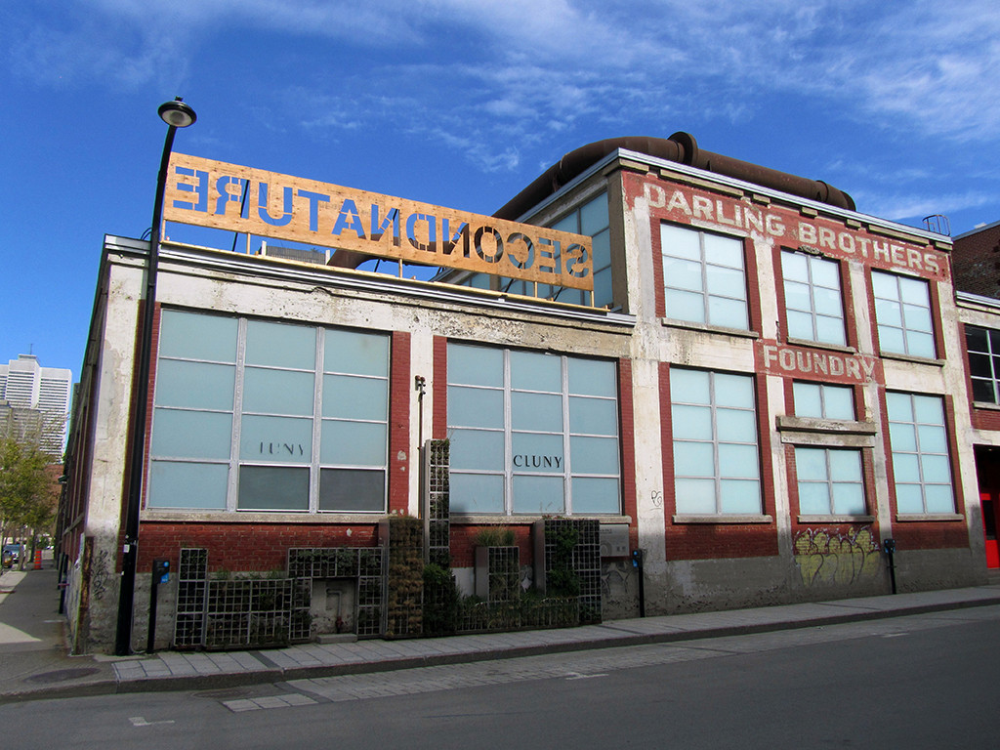
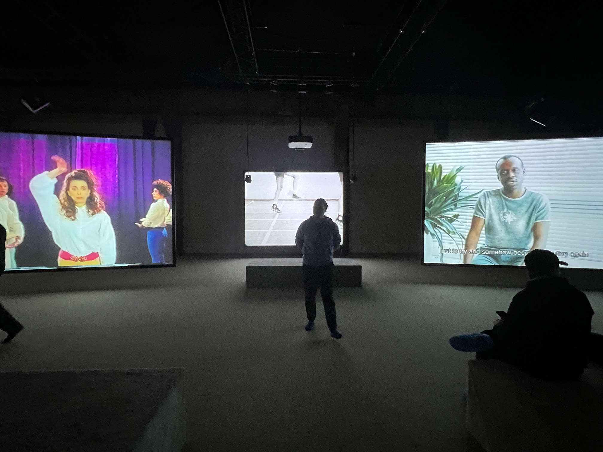
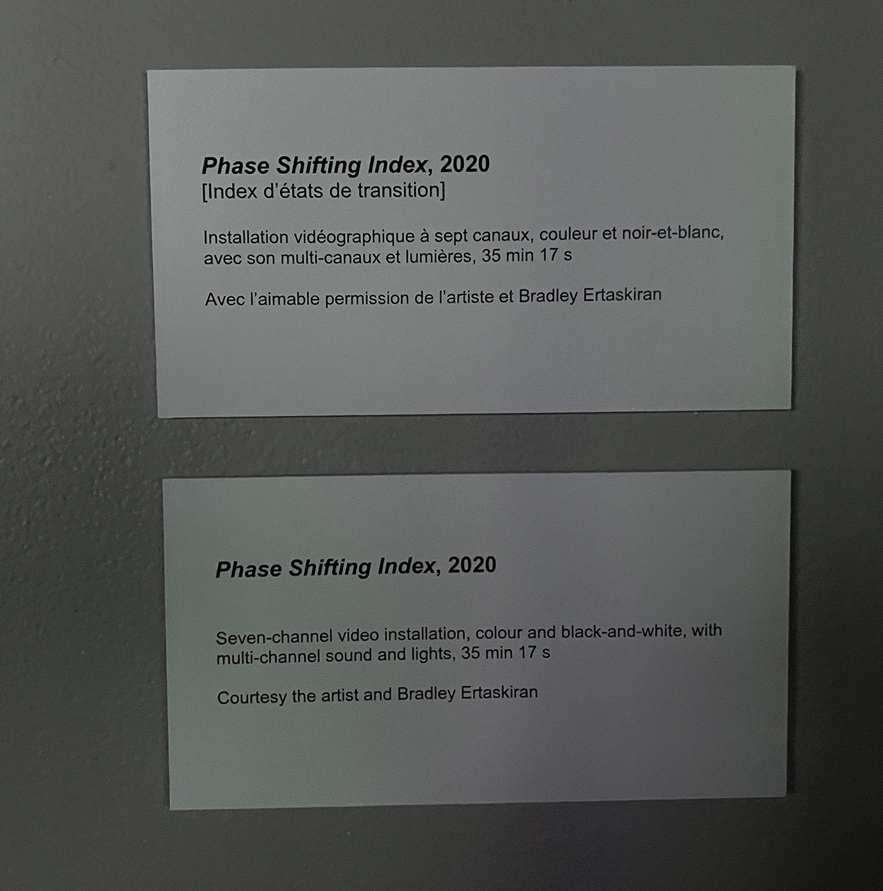
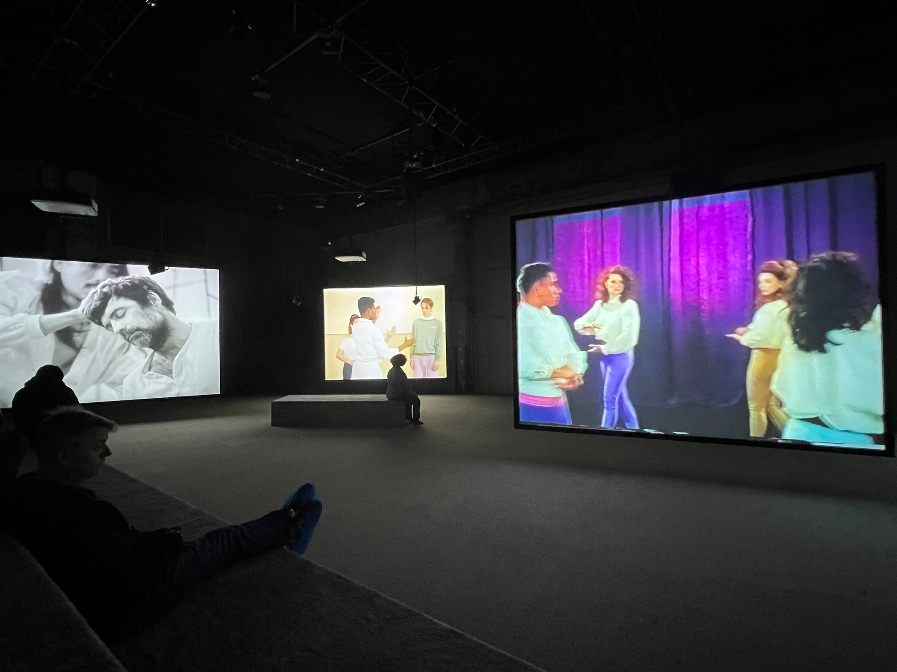
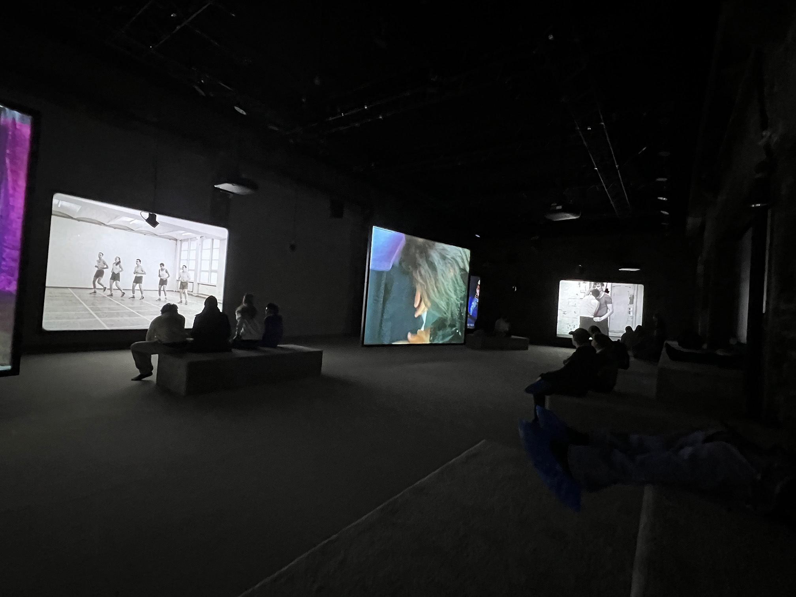
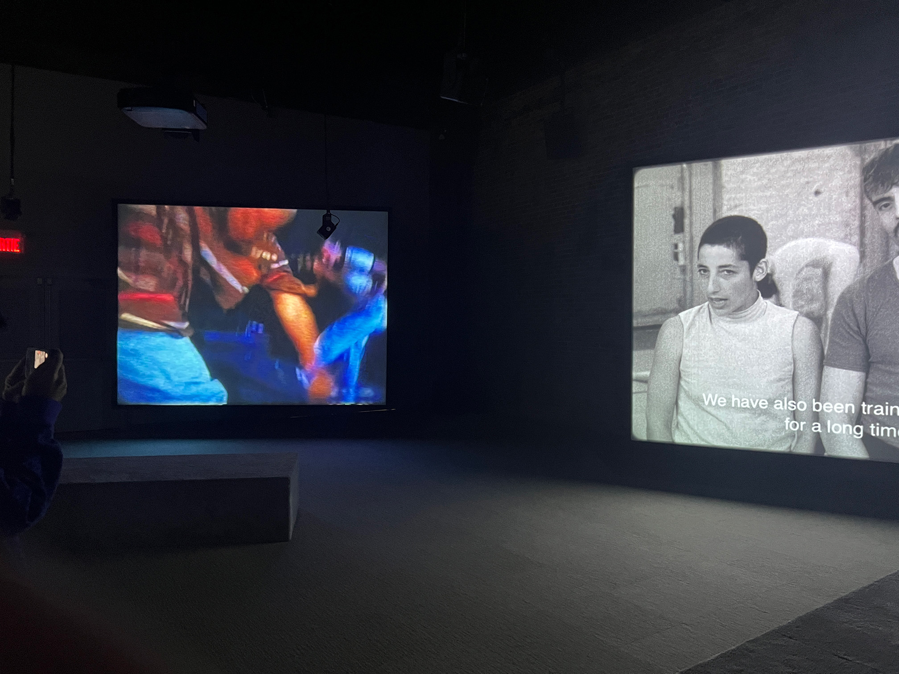
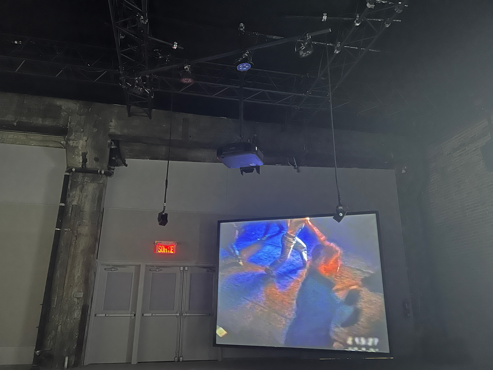
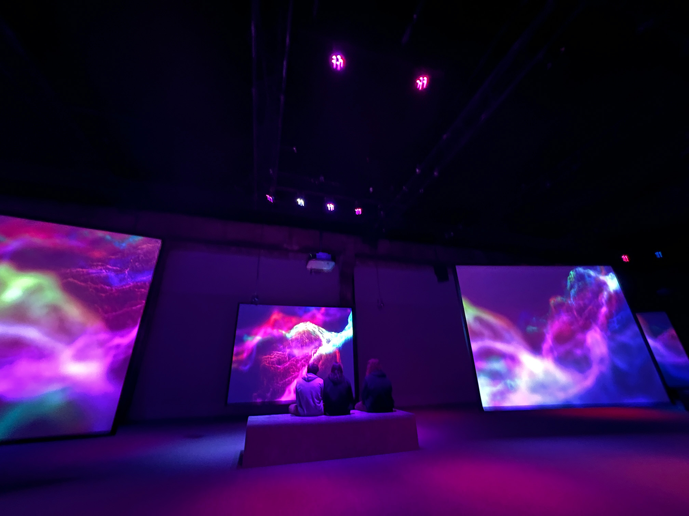
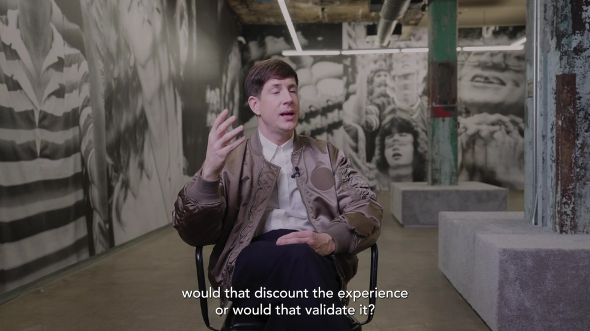

# *Jeremy Shaw: Phase Shifting Index*

### Lieu de mise en exposition: Fonderie Daring - Montréal, Québec

### Type d'exposition: temporaire - intérieure (12 décembre 2023 - 25 février 2024)

### Date de la visite: 31 janvier 2024

## Phase Shifting Index

### Nom de l'artiste : Jeremy Shaw

### Année de réalisation: 2020

## Description de l'oeuvre

 Phase Shifting Index, 2020 [Index d'états de transition]
 
"Installation vidéographique à sept canaux, couleurs et noir-et-blanc, avec son multi-canaux et lumière, 35 min 17 s
 Avec l'aimable permission de l'artiste et Bradley Ertaskiran"

 Vaste installation vidéo immersive à sept canaux, Phase Shifting Index [Index d’états de transition] est une rêverie parascientifique exaltante d’une grande ambition intellectuelle et artistique, et le point culminant des travaux récents de Shaw. Dans ce qui semble être une étude anthropologique d’un futur lointain, une narration commente de manière rétrospective l’émergence de nouvelles réalités déconcertantes sur sept écrans affichant ce qui s’avère être des images d’archives de divers groupes de thérapie par le mouvement des années 60 aux années 90. Ces images sont captées dans les formats de l’époque – allant du film 16 mm au VHS en passant par le Hi-8. 

 

## Type d'installation
Installation Immersive

## Mise en espace

## Composantes et techniques

Panneau acoustique
## Éléments nécessaires à la mise en exposition

## Expérience vécue

### Ce qui vous a plu, vous a donné des idées
Ce qui m'a plu est le fait que chaque film pour chaque installation était différente, mais je pouvais sentir qu'il y avait une connection entre chaque vidéo. Chaque installation avait l'effet de VHS, une narration et les chorégraphies avaient des styles qui montraient un ensemble de cultures.

###  Aspect que vous ne souhaiteriez pas retenir pour vos propres créations ou que vous feriez autrement

### Références
