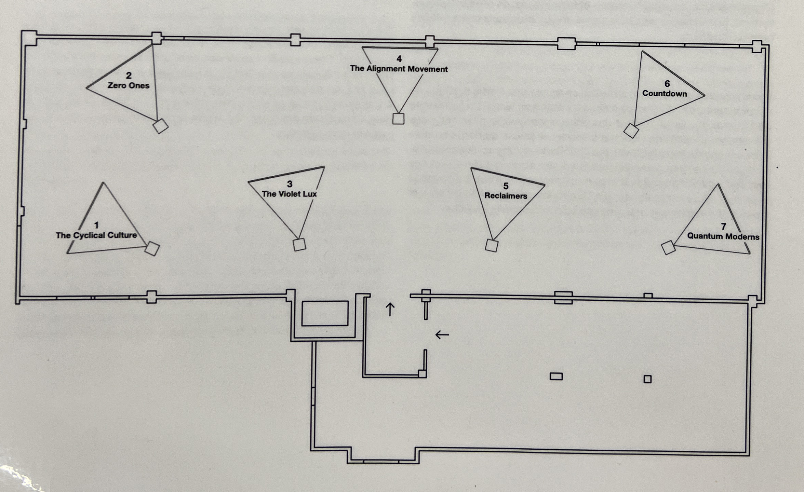

# *Jeremy Shaw: Phase Shifting Index*

### Lieu de mise en exposition: Fonderie Daring - Montréal, Québec

### Type d'exposition: temporaire - intérieure (12 décembre 2023 - 25 février 2024)

### Date de la visite: 31 janvier 2024

## Phase Shifting Index

### Nom de l'artiste : Jeremy Shaw

### Année de réalisation: 2020

## Description de l'oeuvre

 Phase Shifting Index, 2020 [Index d'états de transition]
 
"Installation vidéographique à sept canaux, couleurs et noir-et-blanc, avec son multi-canaux et lumière, 35 min 17 s
 Avec l'aimable permission de l'artiste et Bradley Ertaskiran"

 Vaste installation vidéo immersive à sept canaux, Phase Shifting Index [Index d’états de transition] est une rêverie parascientifique exaltante d’une grande ambition intellectuelle et artistique, et le point culminant des travaux récents de Shaw. Dans ce qui semble être une étude anthropologique d’un futur lointain, une narration commente de manière rétrospective l’émergence de nouvelles réalités déconcertantes sur sept écrans affichant ce qui s’avère être des images d’archives de divers groupes de thérapie par le mouvement des années 60 aux années 90. Ces images sont captées dans les formats de l’époque – allant du film 16 mm au VHS en passant par le Hi-8. 

 

## Type d'installation
Installation Immersive

## Mise en espace

Il y a sept écrans dans la mise en espace. La distances des écrans est séparé de façon égale, 2 à gauche, 3 au milieu et 2 à droite.  Sur le long du mur proche de l’entrer, il y a les estrades. Il y a un trois bancs proches des écrans 1, 4 et 6 pour que le visiteur soit plus absorbé dans l'expérience.

## Composantes et techniques

* 7 écrans de projection
* 7 projecteurs
* gros haut-paleurs
* petits haut-parleurs
* câbles d'audio
* lumières

## Éléments nécessaires à la mise en exposition
* Panneaux acoustiques
* tapis
* bancs
* Câbles et adapteurs
* barres en métal attachées au plafond
* barres de soutien pour les lumières
* Soutiens pour haut-parleurs
* Soutiens pour projecteurs
* Ordinateur
  

## Expérience vécue

Les visiteurs sont accueillis dans une salle avec des portraits de personnes en noir et blanc avec un effet de « glitch » qui sont recouverts sur les murs en entiers. Ces individus semblent être dans un monde. Le guide explique aux visiteurs l’œuvre de l’artiste et l’exploration sur la transcendance que l’artiste veut démontrer. Dans la mise en espace, les visiteurs peuvent se promener ou s’asseoir sur les bancs ou les estrades pour regarder les installations vidéos projetées. 

### Ce qui vous a plu, vous a donné des idées
Ce qui m'a plu est le fait que chaque film pour chaque installation était différente, mais je pouvais sentir qu'il y avait une connection entre chaque vidéo. Chaque installation avait l'effet de VHS, une narration et les chorégraphies avaient des styles qui montraient un ensemble de cultures.

###  Aspect que vous ne souhaiteriez pas retenir pour vos propres créations ou que vous feriez autrement

### Références
