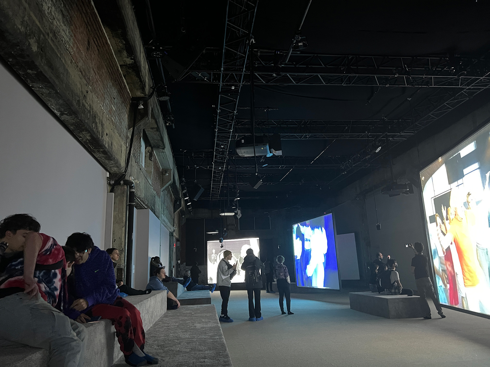

# *Jeremy Shaw: Phase Shifting Index*

### Lieu de mise en exposition: Fonderie Daring - Montréal, Québec
](media/edifice_fonderie_darling.jpg)

(Image prise sur http://www.fonderiedarling.org/)

### Type d'exposition: temporaire - intérieure (12 décembre 2023 - 25 février 2024)
### Date de la visite: 31 janvier 2024

## Phase Shifting Index

### Nom de l'artiste : Jeremy Shaw

### Année de réalisation: 2020

## Description de l'oeuvre 
> Vaste installation vidéo immersive à sept canaux, Phase Shifting Index [Index d’états de transition] est une rêverie parascientifique exaltante d’une grande ambition intellectuelle et artistique, et le point culminant des travaux récents de Shaw. Dans ce qui semble être une étude anthropologique d’un futur lointain, une narration commente de manière rétrospective l’émergence de nouvelles réalités déconcertantes sur sept écrans affichant ce qui s’avère être des images d’archives de divers groupes de thérapie par le mouvement des années 60 aux années 90. Ces images sont captées dans les formats de l’époque – allant du film 16 mm au VHS en passant par le Hi-8.
>
> -- <cite>(https://macm.org/en/exhibitions/jeremy-shaw/)</cite>

   

## Type d'installation
Installation immersive

Exemple vidéo:

## Mise en espace

Il y a sept écrans de projecteurs et  sept projecteurs dans la mise en espace. La distances des écrans est séparé de façon égale, 2 à gauche, 3 au milieu et 2 à droite.  Sur le long du mur proche de l’entrer, il y a les estrades. Il y a un trois bancs proches des écrans 2, 4 et 6 pour que le visiteur soit plus absorbé dans l'expérience.

## Composantes et techniques
### Composantes fournies par l'artiste:
* 7 écrans de projection
* 7 projecteurs
* Gros haut-paleurs
* Petits haut-parleurs
* Câbles d'audio
* Lumières
  

## Éléments nécessaires à la mise en exposition
* Panneaux acoustiques
* Tapis
* Bancs
* Câbles et adapteurs
* Barres en métal attachées au plafond
* Barres de soutien pour les lumières
* Soutiens pour haut-parleurs
* Soutiens pour projecteurs
* Ordinateur
  

## Expérience vécue

(Capture d'écran prise sur https://macm.org/en/exhibitions/jeremy-shaw/)

Avant de rentrer, les visiteurs doivent enlèver leurs chaussures ou les couvrirent avec des platics bleu. Les visiteurs sont accueillis dans une salle avec des portraits de personnes en noir et blanc avec un effet de « glitch » qui sont recouverts sur les murs en entiers. Ces individus semblent être dans un autre monde. Le guide explique aux visiteurs l’œuvre de l’artiste et l’exploration sur la transcendance que l’artiste veut démontrer. 

&nbsp;

Dans la mise en espace, les visiteurs peuvent se promener ou s’asseoir sur les bancs ou les estrades pour regarder les installations vidéos projetées. Aussi, le plancher et les bancs sont couverts de tapis.

Au début des vidéos des installations, chaque groupe parle de leur expérience et effectu chacun leurs propres exercices, dances et thérapies. Personnellement, à ce moment-ci j'étais confu et je ne savais pas quoi trop faire dans la mise en espace. À un moment, les movements des groupes sont en synchronisation et le volume augmente. J'étais captivé quand les groupes étaient en synchronisation.

  

Après un certains temps, comme on peut le voir au début de la vidéo ci-dessus, les lumières clignotent de façon stroboscopique et le son qui sort des haut-parleurs devient sinistres.
Vers 1:20 min de la vidéo, les vidéos se transitions dans un effet de "glitch". À ce moment-ci, il y avait un sentiment étrange que je sentais.

Ensuite, les vidéos se transitionnes dans un moment euphorique et les lumières changes couleurs comme on peut voir sur l'image ci-dessus. Je me sentais calme à ce moment-ci.

À la fin c'était une expérience étrange, mais j'ai bien aimé l'avoir vécu.

## Ce qui vous a plu, vous a donné des idées
Ce qui m'a plu est le fait que chaque film pour chaque installation était différente, mais je pouvais sentir qu'il y avait une connection entre chaque vidéo. Chaque installation avait l'effet de VHS, une narration et les chorégraphies avaient des styles qui montraient un ensemble de cultures différentes. Pour mes prochaines créations, je pourrais faire une expérience avec un thème hors du commun qui est incohérente au début et qui se transition vers une expérience en harmonie. Avec cette façon, je pourrais captiver l'intention des visiteurs ou intéracteurs, car c'était quelque chose qui est inattendue par eux. Le tapis et sa couleur sont quelques choses de simple, mais ils ont beaucoup ajoutés à l'expérience. L'aspect du toucher est quelque chose que je devrait y penser pour mes prochaines créations. 

##  Aspect que vous ne souhaiteriez pas retenir pour vos propres créations ou que vous feriez autrement
Un aspect que je ferai autrement c'est de raccourcir le début des vidéos où il ne passe grand chose pour ajouter du temps dans l'expérience euphorique. Je comprends que l'artiste voulait que les visiteurs prennent le temps de s'immerser dans les oeuvres et ne pas trop les basculer soudainement. Par contre, les meilleurs moments étaient les moments de transcendances et euphoriques, donc si il avait ajouter une autre scène intensive ça aurait améliorer l'expérience et ça aurait plus basculer les visiteurs à la fin.

## Références
http://www.fonderiedarling.org/

https://macm.org/en/exhibitions/jeremy-shaw/

http://patenteux.com/wp/portfolio/liminal-tech-sheet-en/
